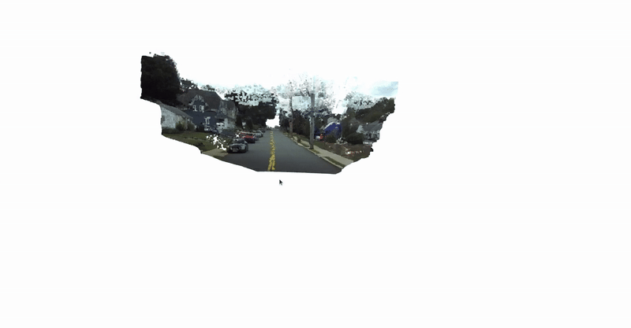

# 3D Reconstruction and Deep Similarity

The goal of this work is two folds
1) To reconstruct 3D points when camera intrinsics,disparity and stereo image pair is given for 100 sampled frames. PS. In this work the
stereo images and resulting disparity map are rectified, and assumed that there is no distortion.

2) To figure out if stereo image pair are more semantically similar than two adjacent left images by generating embeddings out of them by passing them through a pretrained network and use appropriate similarity metric to verify it.


## Steps to reproduce this project

### Project Structure
```
project/
├── data/
│   ├── left_stereo/        # Left camera images
│   ├── right_stereo/       # Right camera images
│   ├── disparity/          # Rectified stereo disparity maps
│   └── stereo_config.txt   # Stereo camera configuration parameters
│
├── 3d_reconstruction/
│   ├── pixels_to_pointcloud.py     # Converts pixel data to point cloud
│   └── reconstruct_pointclouds.py  
│
├── deep_similarity/
│   ├── image_dataloader.py   # Handles dataset loading
│   ├── measure_similarity.py # Computes similarity metrics
│   └── model.py              # Deep learning model definition
│
└── requirements.txt          # Project dependencies

```

### Creating virtual venv and insatalling dependencies
```
pip install virtualenv
virtualenv myenv
source myenv/bin/activate
git clone https://github.com/Prakadeeswaran05/3D-Reconstruction-DeepSimilarity.git
cd 3D-Reconstruction-DeepSimilarity
pip install -r requirements.txt

```

### 3D Reconstruction

To obtain world coordinates (X, Y, Z) from a depth image using the camera's intrinsic parameters, use the following formula:

```
Z = baseline * fx / disparity_image[v, u]
X = (u - cx) * Z / fx
Y = (v - cy) * Z / fy
```

- `(u, v)`: Pixel coordinates in the image.  
- `disparity_image[v, u]`: Disparity value at pixel `(u, v)`.  
- `baseline`: Distance between the two stereo cameras (in mm).  
- `cx`, `cy`: Optical center coordinates (in pixels) along the X and Y axes, respectively.  
- `fx`, `fy`: Focal lengths  along the X and Y axes, respectively.  


I have also provided an option to use voxel filter to downsample points so that pointclouds are efficiently stored.

<div style="display: flex; align-items: center; justify-content: space-between;">
  <div>
    <h3>Original</h3>
    
  </div>
  <div>
    <h3>Downsampled</h3>
    
  </div>
</div>


### Steps to Replicate

Place the necessary files as shown above in data folder

```
cd 3D_Reconstruction/

python3 reconstruct_pointclouds.py --left /path/to/left_stereo --disp /path/to/disparity --out /path/to/clouds --cfg /path/to/stereo_config.txt --disp_thresh 1.5 --downsample 0 --voxel_size 100 --cam_id "LEFT_CAM_FHD" --viz 0

# Command-Line Arguments
# Required:
# --left        : Directory for left stereo images.
# --disp        : Directory for disparity maps.
# --out         : Output directory for point clouds.
# --cfg         : Camera configuration file path.
# --downsample  : Enable downsampling (0 = off, 1 = on).
# --viz         : Enable point cloud visualization (0 = off, 1 = on).

# Optional:
# --voxel_size  : Point cloud voxel size (default: 200).
# --disp_thresh : Minimum disparity threshold (default: 1.0).
# --cam_id      : Camera identifier (default: "LEFT_CAM_FHD").


```

### Deep Similarity

Here the goal is to figure out if stereo image pair are more semantically similar than two adjacent left images by generating embeddings from resnet simple ResNet. 

1) image_dataloader.py- Creates dataloader that creates image pairs either stereo or adjacent left image of shape [2, C, H, W].
2) model.py and measure similarity.py- Takes in image pairs generates embeddings and uses cosine and eucledian similarity metric to tell how close image pairs are.

### Steps to Replicate

Place the necessary files as shown above in data folder

```
cd deep-similarity/
python3 measure_similarity.py --pair both --data_path /path/to/data/


# --data_path    : Root directory of the dataset.

# Optional:
# --pair         : Data loading pair (`stereo`, `adjacent`, `both`, default: `both`).
# --batch_size   : Batch size for DataLoader (default: 8)

```


```
Stereo - Avg Cosine Similarity: 0.9824, Avg Euclidean Similarity: 0.0708
Adjacent - Avg Cosine Similarity: 0.8632, Avg Euclidean Similarity: 0.0274
```

From the above results on an average stereo pairs are more semantically similar to each other than adjacent left images. Both cosine and eucledian are scaled to have values between 0 and 1. Higher values mean more similar.


